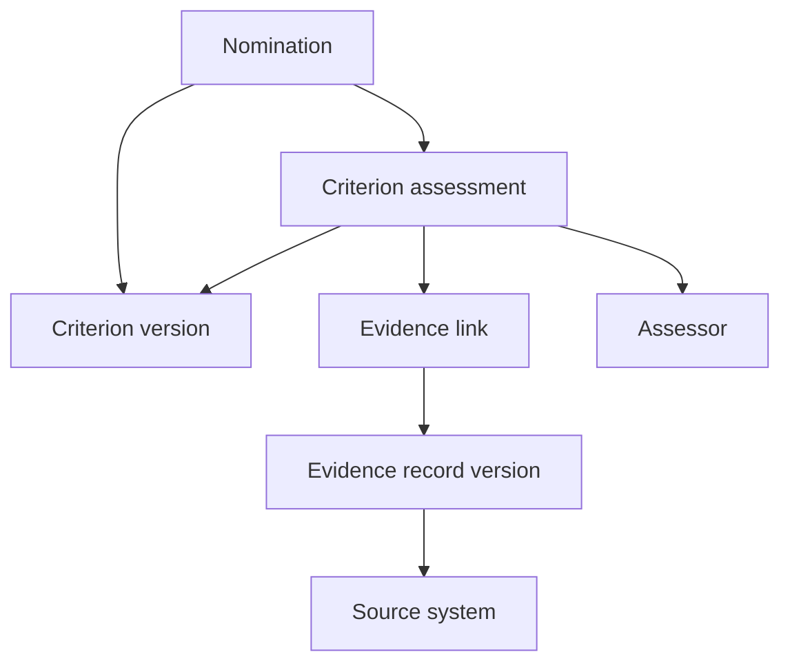

# LIONG People Graph

# People Ontology and Canonical Domain Model

| Document control | Value |
| --- | --- |
| Document ID | LIONG-006 |
| Version | 0.5 |
| Date | 2026-10-03 |
| Status | Version 0.1 approved; maintenance revision |
| Approved dependencies | LIONG-001 through LIONG-005, each approved at version 0.1 |

## Current package status — 2026-10-03

LIONG-001 through LIONG-017 are approved at the baselines recorded in LIONG-REG-001. This maintenance revision consolidates status references; it does not change approved policy. Earlier draft wording and future-tense sequence descriptions describe design history, not pending approval. Implementation gates and unexecuted tests remain open. See [README](README.md) for current document versions and [reference register](LIONG-REF-001_Consolidated_Reference_Register.md) for source links.

## 1. Purpose

This document defines the canonical meaning of the entities and relationships used by the three MVPs. An ontology is a governed definition of concepts and their relationships.

The model supports promotion calibration, rating calibration, and conversational people insights. It does not select a graph database or replace the analytical calculation layer.

The model distinguishes people, employment, assignments, role requirements, evidence, assessments, and decisions. These distinctions remain intact in every physical projection.

Cardinalities below are proposed application constraints. They are not assertions that incomplete source data is already valid. Unresolved records remain in a staging or exception area until validated.

## 2. Model boundaries

The canonical model describes the system-visible evidence world. The generator's complete scenario truth is separate.

Public occupation and skill definitions remain reference concepts. LIONG-specific concepts have their own identifiers. A reference mapping does not equate two concepts unless reviewed scope supports that claim.

One person can have several employment and assignment records over time. One role can describe many positions. A position can be vacant.

A skill requirement does not prove employee competence. A rating records an assessment for a period. A panel decision records an authorized judgment, not objective truth about a person.

## 3. Identifier and version conventions

Use stable opaque identifiers for entities. Do not encode manager, level, site, or employment status in person IDs.

Use a logical project namespace and separate source namespaces. Namespace publication and exact URI patterns belong in LIONG-007.

An entity identifier survives correction. Immutable record-version identifiers preserve earlier values. A reference to evidence in a finalized decision must resolve to a specific version.

Use explicit links for revisions. Do not merge people based only on name similarity. A reviewed identity mapping links a source identity to a canonical person.

## 4. Entity catalogue

### 4.1 Organization and employment

| Entity | Meaning | Required context |
| --- | --- | --- |
| Person | A synthetic individual | Stable person ID; synthetic status |
| Organization | LIONG or a modeled organizational unit | Type, name, validity |
| BusinessUnit | An enterprise business unit | Parent enterprise |
| Department | A department within a business unit | Parent unit |
| Team | An organizational work group | Parent department |
| Site | A primary work location | Geographic context and timezone |
| Employment | A person's employment relationship | Employer, status, start and end |
| Role | Reusable work definition | Job family and role-definition version |
| JobFamily | A group of related roles | Governed label and definition |
| CareerTrack | Technical, specialist, or management path | Track definition |
| JobLevel | A designed scope category | Level code; permitted track context |
| Position | An organizational seat | Role, track, level, team, primary site |
| Assignment | A person's occupation of a position | Employment and effective interval |
| ReportingRelationship | A dated managerial link | Employee and manager assignments |
| SourceIdentityMapping | Reviewed source-to-person linkage | Source system, source ID, status, interval |

Organization hierarchy and location are separate. Temporary site visits do not overwrite a primary assignment.

### 4.2 Work and capability

| Entity | Meaning | Required context |
| --- | --- | --- |
| Goal | An agreed expectation for a period | Subject, scope, dates, version |
| WorkItem | A project, campaign, or work activity | Type, scope, dates |
| Contribution | An identified person's contribution | Person, assignment context, work item, period |
| Outcome | A recorded work result | Work item, measurement or statement, provenance |
| Skill | A defined capability concept | Label, definition, vocabulary source |
| RoleRequirement | A role's required capability | Role version, skill, expectation, applicability |
| LearningItem | A course or development activity | Version and intended learning scope |
| LearningCompletion | A recorded completion event | Person, learning item, date, status |
| CredentialDefinition | A defined credential type | Issuer context and validity rules |
| CredentialRecord | A synthetic person's credential record | Definition, issue date, expiry or validity status |
| SkillAssessment | An assessor's capability judgment | Person, skill, scope, date, evidence |

Do not infer individual contribution from a team outcome. A course can develop a skill without its completion establishing proficiency.

### 4.3 Evaluation and decision

| Entity | Meaning | Required context |
| --- | --- | --- |
| ReviewCycle | A performance period and process | Period, process dates |
| PromotionWindow | A dated nomination and panel window | Submission and evidence cutoffs |
| PolicyVersion | Applicable policy text and rules | Effective interval, authority, version |
| CriterionVersion | A versioned evaluation requirement | Definition, expectation, applicability |
| PerformanceReview | An employee's review case | Cycle, period, linked assignments |
| Nomination | A proposed career change | Person, current assignment, target, window |
| CriterionAssessment | Judgment against one criterion | Case, criterion version, assessor, rationale |
| RatingRecord | Proposed, revised, or final overall rating | Review, category, version, authority |
| CalibrationSession | A scoped review meeting | Participants, scope, cutoff |
| PanelParticipation | A participant's session role | Person, authority role, conflict status |
| Authorization | An administrative or organizational permission | Subject, status, authority, dates |
| Decision | An authorized case outcome | Case, session, outcome, rationale, snapshot |
| ReopeningEvent | An authorized return to review | Prior decision, reason, authority |
| EffectiveChange | An authorized assignment change | Decision, effective date, resulting assignment |
| CohortDefinition | Versioned comparison rules | Dimensions, parameters, exclusions |
| CohortMembership | Inclusion in one comparison | Cohort version, subject, inclusion reason |

A CriterionVersion is an evaluation requirement. A RoleRequirement describes capability needed for work. They can be linked, but are not automatically identical.

### 4.4 Evidence, access, and execution

| Entity | Meaning | Required context |
| --- | --- | --- |
| EvidenceRecordVersion | An immutable structured or document record version | Source, author, event time, availability, classification |
| Claim | A statement about a subject | Subject, predicate or statement type, asserted value, author |
| EvidenceLink | A qualified support or contradiction link | Claim or assessment, evidence version, interpretation |
| EvidenceSnapshot | Manifest of records selected for a case | Cutoff, included version IDs, selection rule |
| SourceSystem | Origin of records | Stable source namespace |
| RetrievalResult | A tool's bounded retrieval response | Scope, records returned, execution status |
| CalculationResult | Governed analytical output | Rule version, input snapshot, denominator where relevant |
| QueryTrace | Authorized execution history | Requester, parameters, tools, source versions |
| AccessGrant | A scoped permission | Principal, scope, action, effective interval |

Document chunks are retrieval artifacts linked to their parent evidence version. They do not become independent evidence sources merely because several chunks match a query.

## 5. Core relationship cardinalities

Counts are per validated record unless the table specifies a time boundary. “0..many” means none or multiple.

| Relationship | Cardinality from subject | Constraint |
| --- | --- | --- |
| Employment → Person | Exactly 1 | An employment record has one person |
| Employment → Employer | Exactly 1 | Initial employer is LIONG |
| Role → JobFamily | Exactly 1 | Initial catalogue has a primary family |
| Position → Role, Track, Level, Team, Site | Exactly 1 of each | Combination must be permitted |
| Assignment → Employment and Position | Exactly 1 of each | Assignment interval fits employment interval |
| Position → Assignments | 0..many over history | At most one primary incumbent at a point in time in the initial model |
| Employment → Assignments | 0..many over history | At most one primary assignment at a point in time unless explicitly allowed |
| ReportingRelationship → EmployeeAssignment | Exactly 1 | No self-reporting |
| ReportingRelationship → ManagerAssignment | Exactly 1 | Both assignments valid during relationship interval |
| SourceIdentityMapping → Person | 0..1 | Exactly 1 only when resolved |
| PerformanceReview → Person and Cycle | Exactly 1 of each | Linked assignments can span several positions |
| PerformanceReview → Assignments | 1..many | Each contributes a defined period |
| Nomination → Person, CurrentAssignment, Window | Exactly 1 of each | Validate context at nomination date |
| Nomination → TargetRole, TargetTrack, TargetLevel | Exactly 1 of each | Target position is optional for a progression route |
| CriterionAssessment → Case and CriterionVersion | Exactly 1 of each | Assessment can have 0..many evidence links |
| RatingRecord → PerformanceReview | Exactly 1 | Category required only for assessed ratings |
| Decision → Case, Session, EvidenceSnapshot | Exactly 1 of each | Finalized decision also requires valid authority |
| EvidenceLink → EvidenceRecordVersion | Exactly 1 | Supports or contradicts exactly one claim or assessment |
| EvidenceSnapshot → EvidenceRecordVersions | 0..many | Empty snapshot is explicit; never proves no work occurred |
| ReopeningEvent → PriorDecision | Exactly 1 | New revisions retain original history |
| EffectiveChange → Decision | Exactly 1 | Approval alone does not create an effective assignment |

A review normally has one final rating at a given revision state. Reopening can produce a later final version. Never erase the earlier final record.

## 6. Evidence and assessment pattern

EvidenceLink records interpretation, author, creation time, and link type. Link types initially include supports, contradicts, and provides_context.

An evidence record can be a source assertion rather than a verified event. Provenance does not establish truth. A manager's feedback remains an attributed assessment.

Confidence, when used, belongs to a specific mapping or inference with a defined method. Do not calculate one unexplained confidence score for a person.

## 7. Temporal model

Retain the following distinctions:

| Time | Meaning |
| --- | --- |
| valid_from and valid_to | Period when employment, policy, or relationship applies |
| event_time or event_period | When the described activity occurred |
| available_at | When the source version became available to the modeled decision process |
| ingested_at | When the integration received the version |
| decided_at | When an authorized decision was recorded |
| effective_at | When the approved change takes effect |

Use half-open validity intervals: include valid_from and exclude valid_to. An absent valid_to means continuing validity, not a known future end.

Availability and ingestion are distinct. Historical reconstructed views must declare whether they represent evidence available in sources or evidence actually received by the decision system.

Corrections create new versions with new availability times. Historical views do not substitute current corrections silently.

## 8. Claim status and missingness

Provenance categories remain OBSERVED, SYNTHETIC, DERIVED, ESTIMATED, and SCENARIO_ASSUMPTION.

Claim status is a separate field: recorded assertion, assessed judgment, inferred claim, disputed claim, or unknown.

A missing record does not imply a negative claim. Validation of a complete case uses explicit application rules. Formal semantic reasoning must not invent closed-world conclusions from an incomplete graph.

Access restrictions are enforced before retrieval. Ordinary users must not learn hidden record existence from missingness metadata unless permitted.

## 9. Standards alignment

Use SKOS concepts and mapping relationships for controlled vocabulary alignment. SKOS provides labels, semantic relationships, and mapping properties. An exact mapping is a strong claim; title similarity is insufficient. [S1]

Use PROV-O patterns to represent source entities, generation or transformation activities, and responsible agents. PROV-O supports interoperable provenance and application-specific extensions. [S2]

Use SHACL as a candidate specification for RDF validation shapes. SHACL defines graph validation against shapes and constraints. [S3]

These are standards-alignment proposals. Software engines and exact artifacts remain unselected. Standards adoption does not establish software license compliance.

Avoid declaring every source identity equivalent with a global identity assertion. A reviewed crosswalk has context, validity, and provenance.

### 9.1 PSDO alignment boundary

[Performance Summary Display Ontology (PSDO)](https://www.ebi.ac.uk/ols4/ontologies/psdo) is an authorized supporting vocabulary for performance summaries and feedback displays (DEC-055). Retain the LIONG core model for employment, assessments, evidence, nominations, authority, and decisions. Selective reuse requires reviewed definitions and pinned mappings. Full import and class equivalence are not approved.

PSDO originated in clinical performance feedback. Cross-domain reuse requires definition-level review.

| PSDO concept area | LIONG mapping candidate | Boundary |
| --- | --- | --- |
| Performance measure and level content | Information about a defined measure and result | Assessor judgments remain attributed assessments |
| Comparator content | Goal, standard, or comparison-group information | LIONG owns applicability and cohort membership |
| Trend content | Information about change across periods | Preserve measure, policy, and assignment context |
| Summary display | Dashboard or feedback-report representation | Presentation does not authorize a decision |
| Scale type | Measure and rating representation metadata | R1–R4 have order; equal spacing is not defined |

These are candidate alignments, not equivalence assertions. Review exact term IRIs, definitions, deprecated terms, inherited axioms, and imports. Do not equate a LIONG job role with a PSDO/BFO display role because their labels match. Do not subtract rating codes to calculate a numeric performance gap. LIONG-013 owns permitted comparisons; LIONG-014 owns display use.

### 9.2 Additional reuse boundaries

See LIONG-005 §8.2 for descriptions, ontology links, and acquisition gates (DEC-056).

| Resource | Brief description | LIONG use | Adoption state |
| --- | --- | --- | --- |
| [ORG](https://www.w3.org/TR/vocab-org/) | Organizational structure, posts, roles, sites, and membership | Map business units, positions, and dated organizational context | Assess for MVP |
| [CTDL-ASN](https://credreg.net/ctdlasn/terms) | Competency frameworks, competencies, rubrics, criteria, and levels | Describe target-level expectations and evaluation rubrics | Assess for MVP |
| [Web Annotation](https://www.w3.org/TR/annotation-model/) | Associations between an annotation body and a resource or selected passage | Link reviewer comments and assessments to exact evidence passages | Assess for MVP |
| [SEPIO](https://www.ebi.ac.uk/ols4/ontologies/sepio) | Scientific claims, evidence lines, supporting information, methods, and agents | Pilot claim-to-evidence links in one promotion dossier | Bounded pilot; cross-domain fit open |
| [PROV-O](https://www.w3.org/TR/prov-o/) | Entities, activities, agents, and provenance relationships | Trace assessment authorship, source versions, derivation, and revisions | Existing alignment; make mappings explicit |
| [OWL-Time](https://www.w3.org/TR/owl-time/) | Temporal instants, intervals, and their relationships | Represent assignment and review periods | Assess a small subset |
| [ESCO](https://esco.ec.europa.eu/en/use-esco) | Linked occupations and skill concepts with relationships | Normalize role/skill references and support later career matching | Existing source assessment |
| [SKOS](https://www.w3.org/TR/skos-reference/) | Concept schemes, labels, semantic relations, and mappings | Maintain controlled terms and reviewed reference mappings | Existing alignment |
| [CTDL](https://www.credreg.com/ctdl/handbook) | Credentials, assessment offerings, learning opportunities, and pathways | Describe later learning and career options | Later scope |
| [ODRL](https://www.w3.org/TR/odrl-model/) | Permissions, prohibitions, duties, and constraints | Express evidence-use policies after access rules are defined | Deferred; enforcement remains in application |

Map Position to an ORG Post candidate; map dated organizational membership through qualified relationships. Retain distinct Employment and Assignment records. ORG membership is not automatically an employment contract. CTDL-ASN criteria describe expectations; assessments retain assessor, evidence, and period. A rubric level is not automatically a LIONG job level.

Web Annotation targets exact evidence versions and passages. SEPIO claim/evidence patterns require a one-case pilot before extending the model. PROV-O records origins, not truth. OWL-Time does not by itself define valid-time versus available-time semantics. Keep those LIONG fields explicit.

ESCO role requirements do not prove person proficiency. SKOS mappings require reviewed meaning, not matching labels. CTDL credentials and learning completion do not establish competence. ODRL expressions do not enforce access. Review overlapping concepts and inherited axioms before composing ontologies. Preserve separate namespaces; no automatic owl:equivalentClass assertions.

## 10. Projection contract

The canonical model can be projected to relational tables, RDF, or a property graph. Projection must preserve identity, temporal context, assessment attribution, evidence versions, and decision history.

First-class qualified relationships can become nodes, association tables, or carefully mapped edge properties. If edge properties cannot preserve multiplicity and version identity, use a relationship entity.

Direct convenience relationships such as HAS_SKILL or REPORTS_TO may be derived views. They must link back to their assessment or dated relationship records and declare the derivation rule.

No projection can treat current convenience edges as complete historical truth. Round-trip checks must compare meaning and required query results, not only record counts.

## 11. Required semantic constraints

| ID | Constraint |
| --- | --- |
| SEM-01 | Person identity remains stable through transfers and promotions |
| SEM-02 | Primary reporting relationships have no cycles within an effective snapshot |
| SEM-03 | Role, track, and level combinations satisfy the approved workforce rules |
| SEM-04 | Evidence references in finalized decisions identify immutable versions |
| SEM-05 | Ratings are scoped to review and assignment context |
| SEM-06 | Assessments identify criteria and assessors |
| SEM-07 | Decision authority is valid at decision time and session scope |
| SEM-08 | Conflicted participants cannot authorize the affected case |
| SEM-09 | Effective changes follow an approved decision and separate authorization |
| SEM-10 | Duplicate evidence retains shared source lineage |
| SEM-11 | Temporal query mode is explicit and reproducible |
| SEM-12 | Hidden evaluation truth is excluded from operational projection |

Some constraints require temporal or application validation beyond simple shape checks. LIONG-007 must assign each rule to a validator rather than imply one ontology engine enforces everything.

## 12. Question coverage

| Question group | Primary model path |
| --- | --- |
| CQ-P01 through CQ-P03 | Nomination → target → policy and criteria → assessments → evidence |
| CQ-P04 and CQ-P05 | Nomination → employment and identity; target → authorization |
| CQ-P06 and CQ-P07 | Assessments and claims → evidence links; session → decision snapshot |
| CQ-P08 and CQ-P10 | Decision → effective change; decision → reopening → revision |
| CQ-P09 | Case → cohort membership → definition and context |
| CQ-R01 and CQ-R02 | Review → rating versions → change rationale and authority |
| CQ-R03 and CQ-R04 | Cohort → member reviews → calculation result |
| CQ-R05 through CQ-R08 | Review → assessments, assignments, source lineage, prior cycles |
| CQ-C01 through CQ-C07 | Evidence versions, policy versions, access grants, query traces |

Analytical distributions remain calculation results. The ontology defines their context and lineage, not their arithmetic execution.

## 13. Synthetic example

Synthetic employee EMP-0042 has assignment ASG-101 through June 2025 and ASG-202 from July 2025. Their 2025 review links both periods.

A learning completion in May provides context for a skill assessment. A project contribution and assessor judgment provide separate support. No completion automatically creates verified proficiency.

A February 2026 panel decision references snapshot SNAP-17. Evidence received in March cannot enter that snapshot retrospectively. A later reopening can cite the new version and preserve the original decision.

These identifiers illustrate model behavior. They are not generated production records.

## 14. Later extensions

Recruiting introduces CandidateProfile and Application. Career paths introduce observed transitions and proposed pathways. Opportunity matching introduces a versioned MatchRecommendation with explicit gaps.

Do not collapse these into READY_FOR person facts. Recommendations and predictions require model versions, inputs, uncertainty, and evaluation.

Learning-effect analysis requires a separate analytical design. A course-to-outcome path establishes linkage, not causation.

## 15. Proposed decisions and open items

| ID | Proposal | Status |
| --- | --- | --- |
| DEC-017 | Represent assignments and qualified evidence relationships explicitly | Approved |
| DEC-018 | Preserve immutable source versions and temporal decision snapshots | Approved |
| DEC-019 | Align vocabulary with SKOS, provenance with PROV-O, and RDF validation with SHACL | Approved |
| DEC-020 | Treat convenience edges as traceable derived views | Approved |

Exact namespaces, physical datatypes, validation artifacts, and storage projections remain in LIONG-007 and LIONG-012. This document does not select tools.

The user approved version 0.1 and DEC-017 through DEC-020 on 2026-10-03. Physical artifacts and component selection remain open.

## 16. Completion gate and next document

The model becomes a baseline when definitions, cardinalities, evidence distinctions, and temporal rules are accepted.

Sequence reference (approved design): LIONG-007 — Data Modeling and Model-as-Code Standard. It will convert these definitions into implementable schema and validation conventions.

## 17. References

Official specifications inspected on 2026-10-03:

- [S1 — SKOS Reference](https://www.w3.org/TR/skos-reference/)
- [S2 — PROV-O](https://www.w3.org/TR/prov-o/)
- [S3 — SHACL](https://www.w3.org/TR/shacl/)

## 18. Change history

| Version | Change | Status |
| --- | --- | --- |
| 0.1 | First canonical entity, relationship, temporal, and evidence model | Approved on 2026-10-03 |
| 0.2 | Records approval; conceptual meaning unchanged | Maintenance revision |
| 0.3 | Adds authorized PSDO scope, link, and release checks | Targeted user-authorized revision |
| 0.4 | Adds authorized ontology shortlist, descriptions, links, and reuse boundaries | Targeted revision |

Maintenance record: 0.5 consolidates the approved package status and index links on 2026-10-03.
