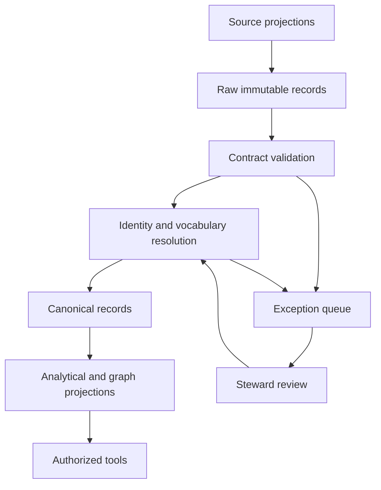

# LIONG People Graph

# Source Systems and Integration Architecture

| Document control | Value |
| --- | --- |
| Document ID | LIONG-009 |
| Version | 0.4 |
| Date | 2026-10-03 |
| Status | Version 0.1 approved; maintenance revision |
| Approved dependencies | LIONG-001 through LIONG-008, each approved at version 0.1 |

## Current package status — 2026-10-03

LIONG-001 through LIONG-017 are approved at the baselines recorded in LIONG-REG-001. This maintenance revision consolidates status references; it does not change approved policy. Earlier draft wording and future-tense sequence descriptions describe design history, not pending approval. Implementation gates and unexecuted tests remain open. See [README](README.md) for current document versions and [reference register](LIONG-REF-001_Consolidated_Reference_Register.md) for source links.

## 1. Purpose

This document defines the logical source systems and integration responsibilities for the People Graph simulation.

The approved generator creates one coherent world. Source projections expose different views of that world. Integration must reconstruct canonical records from those projections without reading hidden simulation truth.

The initial architecture uses batch snapshots and ordered incremental records. Streaming is optional later scope. No product, edition, connector, database, or orchestration tool is selected here.

LIONG-011 will verify component-level licenses and capabilities. LIONG-012 will assemble the selected deployment architecture.

## 1.1 Physical storage boundary

Cloudflare R2 stores all durable data, including synthetic data. Cloudflare, Databricks, and model choices are confirmed exceptions to the open-source rule. All other used components must pass the component assessment. PostgreSQL and Neo4j hold serving copies. Their versioned data exports reside in R2. See LIONG-011 version 0.2, approved on 2026-10-03, and DEC-047/048. Source authority remains defined by field and record type. Object location does not confer business authority.

## 2. Logical source catalogue

| Source ID | Logical source | Owns source records for | Does not establish |
| --- | --- | --- | --- |
| SYS-HR | Employment and organization | People, employment, positions, assignments, reporting periods | Employee competence or final panel judgments |
| SYS-PERF | Performance management | Goals, assessments, proposed ratings, final rating records | Employment identity without reconciliation |
| SYS-LEARN | Learning and credentials | Learning items, completions, credential records | Verified proficiency from completion alone |
| SYS-WORK | Projects and work evidence | Work items, participation, contributions, outcomes | Overall performance rating |
| SYS-CAL | Calibration workflow | Nominations, sessions, conflicts, decisions, revisions, authorizations | Effective employment change until HR records it |
| SYS-DOC | Evidence documents | Feedback text, dossiers, policies, notes, versions | Structured facts outside their source or assessment context |
| REF-BUNDLE | Public and local references | Pinned vocabularies, mappings, definitions | Employee-specific evidence |

These are logical responsibilities. A selected application can implement several responsibilities if the required records and license boundaries remain explicit.

Do not force a full application deployment when a governed source emulator can satisfy the MVP. The source contract must work with either route.

## 3. Source authority and reconciliation

Authority is defined by field and record type, not by one global ranking of systems.

| Concept | Primary source responsibility | Reconciliation rule |
| --- | --- | --- |
| Employment status | SYS-HR | Preserve effective dates and correction versions |
| Role, track, level, position | SYS-HR plus governed definitions | Reject incompatible combinations |
| Proposed rating | SYS-PERF | Retain original assessor and submission version |
| Panel decision | SYS-CAL | Require session scope, authority, rationale, and snapshot |
| Final rating publication | SYS-PERF | Link to authorized calibration decision; flag disagreement |
| Learning completion | SYS-LEARN | Do not convert to assessed competence |
| Project contribution | SYS-WORK | Distinguish contribution from team outcome |
| Policy version | Governed policy owner, published through SYS-DOC | Resolve version and effective period |
| Narrative feedback | Its identified source and author | Preserve as an attributed statement |

If published final rating and panel decision disagree, preserve both and raise a reconciliation exception. Do not choose the latest timestamp without checking authority.

A panel approves a promotion. SYS-HR records its effective assignment change. Pending writeback is a distinct state, not an integration failure by definition.

## 4. Integration flow

Raw storage preserves source records and acquisition metadata. Canonical records preserve validated meaning, source lineage, and record versions.

Analytical and graph projections can publish at different times. Each publication must declare its source checkpoint and release. A question that combines them must use compatible checkpoints or state the difference.

Storage and tooling choices remain open. Immutability is a behavior requirement, not a selected vendor feature.

## 5. Common ingestion envelope

| Field | Requirement |
| --- | --- |
| source_system | Stable source namespace |
| source_contract_version | Version of the payload definition |
| source_record_id | Record identity within that source |
| source_version_id | Immutable source version identifier |
| operation | Upsert, correction, tombstone, or declared event type |
| source_sequence | Ordering key where the source supports one |
| event_time or period | When the represented activity occurred |
| available_at | When the source version became available |
| extracted_at | When the export or retrieval occurred |
| ingested_at | When integration received the record |
| payload | Source-specific data |
| payload_checksum | Digest used for integrity checks |
| access_classification | Classification retained through processing |
| release_id | Synthetic source release or batch identifier |

A transport operation does not define business meaning. A tombstone can indicate source removal without deleting historical panel evidence.

The exact digest algorithm and serialization rules belong in implementation contracts. Checksums require canonical byte or serialization treatment.

## 6. Source-specific minimum contracts

| Source | Required payload groups |
| --- | --- |
| SYS-HR | Source person ID, employment ID, position ID, assignment ID, organization IDs, role/track/level IDs, effective intervals, manager assignment reference |
| SYS-PERF | Review ID, cycle, subject reference, assignment periods, criteria versions, assessor, assessment status, rating stage/category, rationale, evidence references |
| SYS-LEARN | Subject reference, item/credential definition, completion or issue event, status, validity dates, assessment-result reference where present |
| SYS-WORK | Work item, participation, individual contribution, assignment context, work dates, outcome records, author or responsible source |
| SYS-CAL | Case ID, target, window, state, participants, conflict status, decision authority, rationale, snapshot membership, reopening and effective-change references |
| SYS-DOC | Artifact/version ID, author, audience, creation and availability times, classification, content reference, linked case or work item |
| REF-BUNDLE | Publisher/source, release, concept IDs, mapping status, license notices, checksums, transformation version |

Every contract states grain, required fields, allowed missingness, references, and conditional rules. A source can omit optional evidence. It cannot silently alter a mandatory identifier.

## 7. Initial load and increments

### 7.1 Initial load

Load a pinned historical snapshot and the source versions required for the approved review periods. Include enough assignment history to reconstruct cases.

An export manifest records expected files or partitions, row counts by grain, checksums, and source boundaries. Counts validate transport completeness. They do not prove semantic correctness.

### 7.2 Incremental load

Use ordered event or version exports with durable checkpoints. Batch frequency is configurable; no latency SLA is approved here.

Advance a source checkpoint only after raw persistence and declared processing outcomes are durable. Quarantined records must remain traceable even if the source checkpoint advances.

Do not rely only on event_time as a watermark. A late correction can describe an old event. Use source sequence or record-availability/version information plus reconciliation.

### 7.3 Replay

Replay reads pinned raw versions. It must not call the generator's canonical truth service.

A new transformation release creates a new canonical/projection release. Retain prior releases needed to reconstruct historical decisions.

## 8. Idempotency and ordering

Propose the idempotency key: source_system, source_record_id, source_version_id.

An exact repeat is a transport duplicate. A repeat key with different content is a source-integrity exception. Do not overwrite the first record silently.

Ordering is source-specific. If sequence information is unavailable, resolve record-version semantics from the contract. Arrival order alone does not prove business precedence.

Out-of-order records can be stored before their references exist. Keep them pending or quarantined. Publish them only when the required references and validity checks pass.

## 9. Identity resolution

Use explicit source crosswalks and strong identifiers when available. A source-provided crosswalk is still validated and versioned.

Do not merge people using name similarity alone. Candidate matches retain reasons and status. Ambiguous matches require a synthetic steward-review event in the scenario.

Identity mapping has valid dates and source lineage. A correction to a mapping must identify affected canonical records and projections.

Do not copy the hidden generator identity key into operational source payloads. Permitted crosswalks must be designed source records that an actual integration process could use.

## 10. Vocabulary resolution

Map source role labels, rating labels, and organization codes through pinned dictionaries.

Preserve raw and canonical values. Unknown labels remain exceptions. A missing rating category is not normalized to R1.

Reference mappings identify exact, close, broader, narrower, related, or unmapped relationships. Reuse the approved source strategy.

A vocabulary refresh must not redefine historical criteria or dossiers without a versioned mapping and declared interpretation.

## 11. Correction, removal, and publication

Corrections append versions. Canonical current views can change, but historical evidence remains resolvable.

Source removal and access withdrawal require separate treatment. Historical retention does not permit continued unrestricted access. LIONG-015 will define retention, redaction, and disclosure behavior.

Before a dossier is finalized, validate that its evidence and policy versions are durably available to the authorized decision process.

A projection publication manifest identifies included source checkpoints, validation results, unresolved exceptions, and supported query scope.

Partial publication is permitted only when limitations are explicit. Do not publish a complete-status flag while required sources are unavailable.

## 12. Decision snapshots and cross-system reads

A decision snapshot contains exact evidence-version membership, policy version, cutoff mode, and selection-rule version.

Snapshot membership is not a substitute for authorization. Access checks apply whenever evidence is retrieved.

For combined analytical and graph answers, tools must report release IDs. If snapshots differ, either select a common release or provide a bounded answer that identifies the inconsistency.

The conversational layer must not reconcile incompatible releases by guessing.

## 13. Exception handling

| Exception | Processing outcome | Review responsibility |
| --- | --- | --- |
| Invalid schema | Reject payload; retain raw envelope | Source contract owner |
| Unknown source identity | Quarantine linkage | Data steward |
| Unknown vocabulary | Preserve raw label; block affected canonical field | Vocabulary steward |
| Invalid temporal overlap | Quarantine conflicting version | HR data owner |
| Conflicting authority | Preserve both records; block final-status reconciliation | Workflow owner |
| Duplicate key, different content | Raise integrity exception | Source owner |
| Source unavailable | Retain last checkpoint and report freshness | Integration operator |
| Restricted record | Apply access boundary; no unauthorized payload forwarding | Access owner |

Each exception has an ID, source/version references, rule, severity, status, owner, and resolution history.

A planted simulation anomaly is labelled in private evaluation metadata. Operational users see the source condition and permitted exception, not the hidden answer.

## 14. Access and observability

Service identities receive the minimum source and projection permissions needed for their role. Operational ingestion has no access to private evaluation packages.

Classification travels with records. Document chunks inherit the parent evidence classification unless a reviewed rule permits finer treatment.

Log processing counts, failure categories, freshness, checkpoints, and trace IDs. Avoid logging full review narratives or sensitive payloads by default.

Track identity-resolution backlog, vocabulary exceptions, temporal violations, duplicate records, unpublished sources, and projection lag.

Detailed thresholds and retention belong in LIONG-015. These metrics do not become employee performance measures.

## 15. Integration verification

| Check | Required result |
| --- | --- |
| Repeated batch | No duplicate canonical versions or snapshot members |
| Late correction | New version retained; earlier decision unchanged |
| Out-of-order reference | Pending record resolves after parent arrives |
| Identity ambiguity | No automatic person merge |
| Unknown rating label | Explicit exception; no low-rating default |
| Transfer history | Valid period-specific manager and assignment context |
| Decision/HR timing | Approval and effective promotion remain separate |
| Source outage | Bounded retrieval failure; no claim that evidence does not exist |
| Projection mismatch | Common checkpoint or explicit limitation |
| Hidden truth boundary | Pipeline cannot access canonical scoring shortcuts |

These checks test behavior rather than reproduce mapping code. Numerical volume and latency targets remain open.

## 16. Implementation sequence

Start with source emulators or file-based contracts for one connected case. Validate initial load, correction, replay, and identity resolution.

Then assess open-source applications against these contracts. Use a full application only when it provides useful workflow or source behavior within the component license constraint.

Expand to the approved workforce checkpoint after the case-level pipeline passes. Add streaming only if a scenario or measured requirement justifies it.

## 17. Proposed decisions and open items

| ID | Proposal | Status |
| --- | --- | --- |
| DEC-031 | Seven logical source responsibilities with field-level authority | Approved |
| DEC-032 | Batch snapshots and ordered increments for the first release | Approved |
| DEC-033 | Source/version idempotency and immutable replay records | Approved |
| DEC-034 | Explicit exception review and compatible projection checkpoints | Approved |
| DEC-035 | Contract-first source emulation before full application deployment | Approved |

Component selection, batch cadence, operational targets, retention, and implementation schemas remain open.

OI-03 remains open: the approved generation strategy does not yet supply a complete numerical joint workforce allocation.

The user approved version 0.1 and DEC-031 through DEC-035 on 2026-10-03. Components remain unselected.

## 18. Impact and next document

LIONG-008 and DEC-026 through DEC-030 are approved. The initial opening checkpoint is 2026-01-01; the current-world checkpoint is 2026-10-01.

This document applies those boundaries and updates the decision register. It does not change approved generation rules.

Sequence reference (approved design): LIONG-010 — Enterprise Evidence Corpus Strategy.

## 19. Change history

| Version | Change | Status |
| --- | --- | --- |
| 0.1 | First logical source catalogue, integration contracts, replay, and reconciliation design | Approved on 2026-10-03 |
| 0.2 | Records approval; integration rules unchanged | Maintenance revision |
| 0.3 | Aligns source and publication storage with R2; authority and replay rules unchanged | Maintenance revision |

Maintenance record: 0.4 consolidates the approved package status and index links on 2026-10-03.
