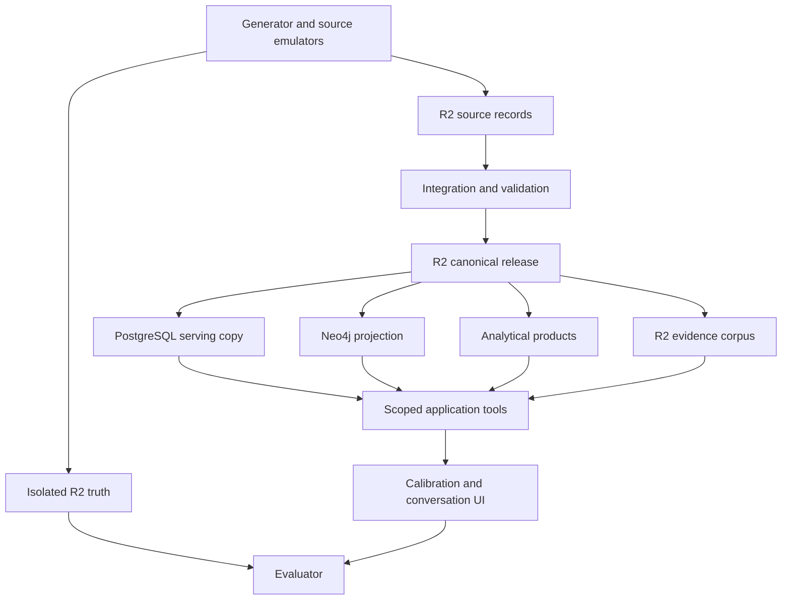
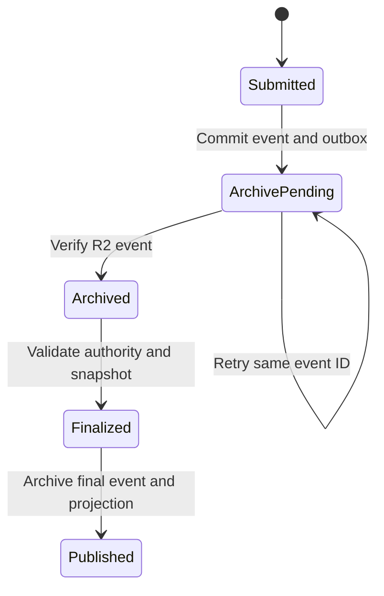

# LIONG People Graph

# End-to-End Solution Architecture

| Document control | Value |
| --- | --- |
| Document ID | LIONG-012 |
| Version | 0.5 |
| Date | 2026-10-03 |
| Status | Version 0.3 approved; maintenance revision |
| Approved dependencies | LIONG-001 through LIONG-010 v0.1; LIONG-011 v0.2; DEC-047/048 |
| Implementation status | Design only; no services or integrations deployed |

## Current package status — 2026-10-03

LIONG-001 through LIONG-017 are approved at the baselines recorded in LIONG-REG-001. This maintenance revision consolidates status references; it does not change approved policy. Earlier draft wording and future-tense sequence descriptions describe design history, not pending approval. Implementation gates and unexecuted tests remain open. See [README](README.md) for current document versions and [reference register](LIONG-REF-001_Consolidated_Reference_Register.md) for source links.

## 1. Purpose and architecture decision

This document connects the approved source, model, corpus, and component designs. It defines storage responsibilities, processing boundaries, publication, query routing, and recovery.

Cloudflare R2 holds all durable data. This includes public reference packages, synthetic data, source records, canonical releases, documents, serving exports, decisions, and evaluation packages. PostgreSQL and Neo4j hold serving copies for transactions and queries. Local files are temporary working copies.

Cloudflare, Databricks, and model choices are explicit exceptions to the open-source requirement. All other used components require the version-specific assessment in LIONG-011. An allowed service is not automatically required. Databricks remains optional. No exact model or deployment version is selected here.

The first build supports promotion calibration, rating calibration, and conversational people insights. It does not automatically authorize a promotion or assign an employee rating.

## 2. Terms and authority

| Term | Meaning |
| --- | --- |
| Source record | A versioned record owned by a logical source responsibility |
| Generator truth | Complete synthetic world used to create cases and score results |
| Canonical release | Validated operational records assembled from available source evidence |
| Serving projection | A query or transaction representation loaded from a declared release |
| Publication manifest | A versioned list of objects, checkpoints, mappings, and validation results |
| Active release | A published release selected for a defined query scope |
| Archive acknowledgment | Verified R2 persistence of the exact event or snapshot content |
| Decision snapshot | Exact evidence, policy, and selection versions used by a decision |

Canonical operational records are not generator truth. Integration constructs them from source-visible records. Generator truth does not resolve integration ambiguities.

R2 is the storage authority for durable artifacts. It is not the business authority for every fact. SYS-HR owns effective assignments. SYS-CAL owns panel decisions. SYS-PERF publishes final rating records. The field-level authority rules in LIONG-009 still apply.

## 3. Logical topology



The UI-to-evaluator arrow represents captured test results. It does not grant the application access to truth. The evaluator is a separate test process with separate credentials.

## 4. Component responsibilities

| Component | Responsibility | Persistent representation in R2 | Boundary |
| --- | --- | --- | --- |
| Python generator, Faker, Jinja | Generate coherent records and template-first documents | Configuration, seeds, truth, source releases, corpus outputs | Truth credentials never enter integration or serving |
| Integration worker with Pydantic | Validate envelopes, map identities, reconcile versions | Raw inputs, exceptions, canonical releases, run manifests | Uses source-visible evidence only |
| DuckDB | Bounded joins, reconciliation, cohort calculations | Analytical results and calculation manifests | No authoritative personnel decision |
| Optional Databricks jobs | Alternative batch generation or transformation | Inputs, outputs, job configuration references, run results | Edition and R2 route require validation |
| RDFLib and pySHACL | Author semantic artifacts and validate supported constraints | Ontology, shapes, reports, mapping versions | Temporal and policy checks also require application rules |
| NetworkX | Offline hierarchy and fixture checks | Check reports | No multiuser query authority |
| PostgreSQL | Identity mappings, serving records, workflow transactions, query traces | Versioned changes, snapshots, recovery exports | Not the only durable location of data |
| Neo4j Community core | Traverse derived evidence and assignment relationships | Projection manifest and reconstructible exports | Service credentials only; enforce access in tools |
| FastAPI and Jinja | Expose scoped APIs and case interfaces | Case events, rendered dossier versions, audit exports | Validates user scope and state transitions |
| Keycloak | Authenticate people and service identities | Protected configuration and recovery exports | Business evidence authorization remains in the application |
| Selected model | Interpret questions and compose grounded answers | Permitted request metadata, provider/model revision, answer trace | Receives only authorized evidence; no raw storage credentials |

Dagster, MCP, LangGraph, OPA, pgvector, Superset, and Jena/Fuseki remain optional under LIONG-011. Add one only when its specific workload and component gates justify it. An MCP adapter changes tool access format; it does not become an authorization authority.

Credential values are not data-release contents. Inject secrets through the deployment environment. Never place them in ordinary manifests, prompts, or source-control files. Any recovery copy of sensitive identity state requires its own protected boundary.

### 4.1 PSDO semantic and display path

[Performance Summary Display Ontology (PSDO)](https://www.ebi.ac.uk/ols4/ontologies/psdo) is an authorized supporting vocabulary for performance summaries and feedback displays (DEC-055). Retain the LIONG core model for employment, assessments, evidence, nominations, authority, and decisions. Selective reuse requires reviewed definitions and pinned mappings. Full import and class equivalence are not approved.

Acquisition publishes the pinned ontology, license evidence, and dependencies to R2 reference storage. Reviewed mappings enter the semantic model release. Analytical and interface tools can use measure, time, comparator, and scale metadata in performance summaries.

This extends the existing semantic-library path without a new service. LIONG-013 will specify valid comparisons. LIONG-014 will specify feedback presentation. The model must not infer promotion readiness or numeric distance between rating categories from PSDO. Architecture version 0.2 is subsequently approved; release and deployment checks remain open.

### 4.2 Additional semantic vocabulary path

The resources described and linked in LIONG-005 §8.2 and LIONG-006 §9.2 follow the same R2 acquisition, reviewed mapping, semantic validation, and projection path as PSDO. DEC-056 authorizes assessment rather than full import.

ORG supplies organizational context; CTDL-ASN supplies competency and rubric definitions; Web Annotation supplies exact passage targets; PROV-O supplies origins and derivations. Assess OWL-Time for interval interchange and SEPIO for claim/evidence links. SKOS and ESCO normalize references. CTDL and ODRL remain later or deferred. None replaces LIONG policy, decision authority, access enforcement, or historical availability rules.

The user approved architecture version 0.2 on 2026-10-03. This revision adds the authorized shortlist. Exact releases, physical mappings, and deployment checks remain open.

## 5. R2 layout and access

Propose the following buckets for the simulation. Names are design examples.

| Bucket | Contents | Writers | Readers |
| --- | --- | --- | --- |
| liong-reference | Public packages, reuse evidence, mapped vocabularies | Acquisition worker | Generator and integration |
| liong-truth | Complete synthetic world and private anomaly labels | Generator | Generator and evaluator |
| liong-source | Source extracts, events, corrections, envelopes | Source publishers | Integration |
| liong-canonical | Validated operational releases and semantic artifacts | Release publisher | Projection and analytics workers |
| liong-evidence | Document versions, extraction outputs, chunk manifests | Corpus publisher | Scoped retrieval service |
| liong-serving | Projection exports, workflow events, recovery snapshots | Authorized serving exporters | Loaders and recovery operators |
| liong-evaluation | Scoring keys, fixtures, evaluation results | Evaluation publisher | Evaluator |
| liong-operations | Run reports, bounded logs, publication and audit records | Authorized workers | Operators and auditors |

Separate buckets support separate credentials. A prefix is an organizational convention, not an access guarantee. Cloudflare documents bucket-scoped object permissions [S2]. Do not claim that these credentials implement employee-level evidence restrictions.

Keep buckets private. Operational tools cannot read liong-truth or liong-evaluation. The corpus publisher receives source-visible author bundles; it does not receive unrestricted truth to draft realistic narrative.

Suggested object keys:

```text
releases/<release_id>/records/<entity>/<partition>/<part_id>.parquet
releases/<release_id>/manifest.json
sources/<source_id>/<batch_id>/<record_version_id>.json
evidence/<evidence_id>/<version_id>/document.md
evidence/<evidence_id>/<version_id>/chunks.jsonl
workflow/<event_id>/event.json
recovery/<snapshot_id>/manifest.json
```

Use Parquet for typed batch records and JSON/JSONL for envelopes and events. Use Markdown for template-first evidence. Retain original source bytes where a source format differs. Exact compression and partition sizes remain implementation choices.

Store schema version, record count, byte count, and a project-computed SHA-256 digest in each manifest entry. Do not treat an object ETag as a universal content digest. Application record versions use distinct object keys. Do not assume S3 bucket versioning or Object Lock API parity; R2 documents supported and unsupported API operations [S1]. R2 bucket locks are a separate feature to assess against retention and deletion rules [S3].

## 6. Initial generation and ingestion

1. Pin approved definitions, reference packages, schemas, and mappings.
2. Generate the workforce and chronological events under LIONG-008.
3. Write truth and private scoring artifacts to their isolated buckets.
4. Publish source-specific releases with permitted identities and knowledge boundaries.
5. Read source releases through integration credentials.
6. Validate schema, identities, vocabulary, temporal consistency, and source authority.
7. Persist rejected or pending items with exception IDs. Keep sensitive detail scoped.
8. Publish a canonical release candidate and validated evidence corpus.
9. Build relational, graph, and analytical projections from that candidate.
10. Reconcile counts, version references, and competency-question fixtures.
11. Activate the release only after the required projections pass.

The opening population remains 800 active direct employees at 2026-01-01. The current scenario checkpoint remains 2026-10-01. Preserve completed 2023–2025 cycles and an incomplete 2026 cycle. This document does not change those approved assumptions.

## 7. Publication protocol

R2 objects, database transactions, and graph loads do not form one shared transaction. Use explicit staging and activation.

| State | Required condition | Permitted use |
| --- | --- | --- |
| Building | Objects and transformations are incomplete | Worker-only checks |
| Validated | Objects and required validation reports are complete | Projection construction |
| Projected | Required projections pass reconciliation | Controlled smoke checks |
| Active | A serialized publisher selects the tested release | Authorized user queries |
| Failed | A required check or load fails | Investigation; keep prior active release |
| Retired | Release is no longer active | Authorized history and recovery |

Write objects first. Write the immutable manifest only after all listed objects pass integrity checks. Each serving projection reports the release ID and mapping version it loaded.

Use a single publisher for activation in the first simulation. Record activation history in PostgreSQL and R2. Do not let multiple workers overwrite a shared active pointer without a concurrency protocol. The application treats activation as complete only after both activation records agree.

Keep the previous active release until activation succeeds. A failed graph load must not move only the analytical interface to a new complete-status release. Partial service can be allowed for an explicitly bounded question scope. It cannot claim full consistency.

## 8. Interactive writes and decision durability

Managers and panel members create workflow records after a batch release. PostgreSQL handles concurrency and case state. R2 must receive the exact durable event representation.

Propose a transactional outbox. An outbox is a table of export events written in the same database transaction as a workflow change.



Before finalization, freeze and archive the evidence snapshot, policy versions, proposed outcome, authority, and rationale. Verify their objects and digests. Then finalize the case transaction and create its final-event outbox item.

The interface distinguishes a submitted action, a locally committed action, and a durably published action. It must not report durable finalization until the final event is archived. An exporter retries with the same event ID and digest. Different content for one ID is an integrity exception.

An outage between database commit and R2 acknowledgment leaves a pending export. Recovery retries it. An outage after R2 write but before acknowledgment causes an integrity check and acknowledgment, rather than a second business event.

This protocol does not create a distributed transaction or prove zero data loss. Define and test export lag, backup intervals, recovery point, and recovery time before deployment. If R2 is unavailable, block durable finalization. Draft work may continue only with a clear pending status and an approved recovery policy.

Promotion approval and effective assignment remain separate events. A published panel decision does not update SYS-HR silently. The HR source records the effective assignment and date through its own contract.

## 9. Serving model and projection contracts

PostgreSQL separates source/canonical serving data, workflow data, evidence indexes, analytical products, and bounded audit records. Physical schema names remain implementation choices under LIONG-007.

Neo4j stores Person, Assignment, Position, Role, CriterionVersion, Assessment, Case, EvidenceRecordVersion, Decision, and their qualified relationships. It also stores projection metadata. Convenience relationships retain mapping and source-version references. A relationship to an employee does not establish competency by itself.

Large document bodies stay in R2. The serving index stores an evidence-version ID, classification, author, dates, object locator, digest, and authorized retrieval metadata. A storage locator is not a public citation URL.

Load each projection with a declared release ID. Select historical state through valid-time and available-time rules. Never use a current assignment shortcut for a nomination made before a transfer.

The initial UI can show a frozen dossier and separately show newer draft activity. If tools combine these views, the answer must identify the base release and workflow event checkpoint. Do not present a live draft as part of an earlier decision snapshot.

## 10. Analytical and evidence query routing

| Question class | Primary tool | Evidence or analytical output | Required context |
| --- | --- | --- | --- |
| Criterion coverage and nomination history | Graph traversal with relational verification | Assessments, evidence versions, gaps, decisions | Case, target criteria, cutoff, release |
| Rating distributions | Governed SQL or materialized analytical product | Counts, denominator, exclusions, missingness | Cohort definition, cycle, rating stage |
| Manager distribution differences | Cohort analysis plus evidence drilldown | Review signal with team composition | Assignment periods and comparable cases |
| Decision explanation | Frozen snapshot retrieval | Rationale, authority, cited evidence | Decision version and authorization |
| Promotion effectiveness | HR assignment tool | Effective event or pending state | Decision and HR source checkpoint |
| Narrative evidence | Lexical evidence search and version resolver | Authorized passages and parent references | Scope, cutoff, classification |

Start with lexical search and explicit evidence links. Add embeddings only after retrieval evaluation demonstrates value. Similarity does not replace evidence lineage or authority.

Conversational requests follow this sequence:

1. Authenticate the requester and resolve business scope.
2. Identify the question, case or cohort, cutoff mode, and rating stage.
3. Choose a compatible release and authorized tool plan.
4. Execute bounded tools with validated parameters.
5. Resolve and authorize evidence before it enters model context.
6. Generate an answer with citations, limitations, and known gaps.
7. Check that cited versions belong to the returned authorized set.
8. Record the tool, release, model, and answer trace under its access policy.

No agent receives arbitrary SQL, Cypher, R2 browsing, database credentials, or evaluator tools. Returned documents are evidence content, not executable instructions.

## 11. Worked promotion case

This example is a fictional fixture. It does not add a policy.

Employee PER-EX-001 transfers from one terminal team to another during 2025. Two managers assess different periods. A nomination targets the next level in April 2026. One criterion lacks an assessment at the original cutoff. Supporting evidence arrives after the panel decision.

| Step | System behavior |
| --- | --- |
| Source publication | HR records both assignments; performance records both scoped assessments |
| Integration | Resolves source identities and preserves the periods and available timestamps |
| Dossier construction | Links criterion versions to authorized evidence available by the cutoff |
| Gap handling | Reports the specific missing assessment; does not infer a low rating |
| Panel finalization | Archives the snapshot and decision events before reporting durable publication |
| Late evidence | Creates a new available version without rewriting the original snapshot |
| Reopening | Creates an authorized revision with its own rationale and snapshot |
| Effective promotion | Remains pending until the HR source records the assignment change |

A historical explanation uses the original snapshot. A retrospective explanation can describe later evidence only when it labels the later time context. A requester outside the case scope receives no unauthorized dossier details.

## 12. Deployment profiles and Databricks option

| Profile | Services | Intended stage |
| --- | --- | --- |
| Foundation | R2, Python workers, DuckDB, semantic libraries | Generate and validate one connected case |
| Calibration | Foundation plus PostgreSQL, Neo4j, FastAPI/Jinja, Keycloak | Authorized rating and promotion workflows |
| Conversation | Calibration plus selected local or hosted model and governed tools | Evidence-grounded people questions |
| Expanded processing | Optional Databricks, orchestration, and source-app pilots | Larger repeatable workloads or integration demonstrations |

Run non-exempt services in a reviewed Linux environment. Native processes or reviewed Podman images are possible. Store application code and small configuration templates in Git. Store all generated data and recovery exports in R2.

Do not deploy PostgreSQL or Neo4j database files as live files inside an object bucket. Their engines use supported local or attached storage and publish data representations to R2. Temporary worker disks and database volumes require their own loss and restoration plan.

For Databricks, first test the selected edition, credentials, endpoint, input/output route, file formats, and permission isolation. A successful S3 SDK request does not establish support for a workspace table catalog or Spark storage connector.

The fallback is a controlled worker that reads R2 and stages temporary files for the selected processing environment, then publishes validated outputs back to R2. Select it only if temporary staging and provider data handling meet the requirement. If direct R2 connectivity is required and unsupported, retain Python/DuckDB processing. No Databricks compatibility is claimed as tested here.

## 13. Access, observability, and recovery

| Control area | Architecture requirement | Detailed owner |
| --- | --- | --- |
| User identity | Validate tokens and service identity | LIONG-015 |
| Business authorization | Resolve case, assignment, HR, and panel scope before query and retrieval | LIONG-015 |
| Model boundary | Send permitted minimum evidence; assess hosted data handling | LIONG-014/015 |
| Temporal correctness | Carry valid time, available time, cutoff mode, and release IDs | LIONG-007/009 |
| Evidence access change | Recheck authorization; historical membership does not override current access | LIONG-015 |
| Retention | Reconcile deletion/redaction needs with frozen snapshots and bucket locks | LIONG-015 |
| Operations | Record counts, lag, exceptions, pending exports, and trace IDs | LIONG-015 |
| Evaluation | Test behavior against isolated answer keys | LIONG-016 |

Monitor publication failures, identity ambiguity, invalid temporal intervals, export backlog, projection lag, unresolved citations, and unauthorized retrieval attempts. Keep full personnel narratives out of ordinary logs.

Recover from a pinned release manifest. Verify its objects and digests, load PostgreSQL serving records, rebuild Neo4j, restore analytical products, and replay archived workflow events in contract order. Restore access rules before enabling users.

PostgreSQL recovery snapshots and required log archives reside in protected R2 storage. Establish their consistency and replay boundaries before use. Keycloak recovery also requires identity-state exports and compatible server configuration. Do not claim that rebuilding the graph restores all application state.

Run a restoration exercise that includes a finalized decision, a pending export, a late correction, and an access withdrawal. Measure recovery objectives. These objectives remain open rather than invented service guarantees.

## 14. Architecture acceptance gates

| Gate | Required demonstration |
| --- | --- |
| R2 coverage | Every persistent data class has a declared R2 representation and tested writer/reader |
| Isolation | Operational credentials cannot read truth or scoring keys |
| Reference integrity | Dataset license, package version, and mapping lineage remain resolvable |
| Replay | Repeated ingestion creates no duplicate record versions |
| Historical correctness | Transfer, cutoff, and late-evidence fixtures return the proper versions |
| Publication | Failed projection keeps the last valid active release |
| Cross-store durability | Export retries preserve event identity; outage does not report premature durable finalization |
| Workflow authority | Panel approval and effective HR change remain separate |
| Query consistency | Combined tools use a common release or explicitly bounded checkpoints |
| Citation access | Unauthorized evidence is filtered before model context and citation resolution |
| Recovery | Archived releases and events reconstruct the selected tested checkpoint |
| Component boundary | Non-exempt components qualify; exempt services/models meet recorded terms and capability checks |

LIONG-016 owns numerical accuracy, latency, and recovery thresholds. No performance benchmark, cost estimate, or deployed security assurance is claimed here.

## 15. Approved decisions and open items

| ID | Proposal | Status |
| --- | --- | --- |
| DEC-049 | Separate R2 buckets and service credentials for truth, sources, evidence, and evaluation | Approved |
| DEC-050 | Stage, validate, reconcile, and activate a release through one initial publisher | Approved |
| DEC-051 | Transactional outbox and R2 acknowledgment for workflow publication | Approved |
| DEC-052 | PostgreSQL and Neo4j serving copies with versioned R2 exports and recovery artifacts | Approved |
| DEC-053 | Common release and scoped query routing with citations resolved before model context | Approved |
| DEC-054 | Python/DuckDB first; Databricks as a tested optional processing route | Approved |

Open items include export lag and recovery objectives, object retention, bucket-lock configuration, exact service deployment, model choice, Databricks edition and connectivity, final authorization policies, and PPC configuration verification.

The user approved LIONG-011 v0.2, including its named exceptions and component recommendations. That approval does not pass unresolved artifact, compatibility, or deployment gates. Architecture choices DEC-049 through DEC-054 are approved; implementation gates remain open.

## 16. Reference-project reuse and research boundary

Use the PPC R2 pattern as the intended storage baseline. Preserve its useful separation of durable artifacts, compute, analytical products, and graph-serving responsibilities, as described in the prior project comparison. Adapt the access boundaries to personnel evidence and hidden scoring data.

The PPC architecture page was not retrievable in this session. No exact bucket names, scripts, connector settings, or working code are claimed as copied or verified. Verification of that configuration remains an implementation task.

Official R2 pages were inspected on 2026-10-03. They confirm only the cited service capabilities. Publication, outbox, and serving arrangements above are LIONG design proposals.

| ID | Reference | Use |
| --- | --- | --- |
| S1 | [R2 S3 API compatibility](https://developers.cloudflare.com/r2/api/s3/api/) | Check supported operations; do not assume S3 feature parity |
| S2 | [R2 authentication](https://developers.cloudflare.com/r2/api/tokens/) | Bucket-scoped object credentials |
| S3 | [R2 bucket locks](https://developers.cloudflare.com/r2/buckets/bucket-locks/) | Retention feature to assess separately from S3 Object Lock |
| R1 | [PPC architecture and stack](https://github.com/aadehamid/pearland-petroleum-corporation/blob/main/docs/PPC-002_Enterprise_Architecture_and_Technology_Stack.md) | Intended comparison; current page unavailable during this draft |

## 17. Impact and next document

LIONG-001, LIONG-005, LIONG-007, LIONG-008, LIONG-009, and LIONG-010 now reflect the user-authorized R2 storage and component exceptions. LIONG-006 requires no concept change. LIONG-011 records approval of version 0.2. The register records new architecture proposals separately.

LIONG-013 — Calibration Analytics and Decision Provenance is drafted for review. Its cohort and calculation choices remain proposals. The user approved this architecture version 0.3 and the ontology update set on 2026-10-03. Artifact and deployment checks remain open.

## 18. Change history

| Version | Change | Status |
| --- | --- | --- |
| 0.1 | First architecture, R2 layout, serving contracts, publication protocol, decision durability, query routing, and recovery design | Pending review |
| 0.2 | Adds authorized PSDO scope, link, and release checks | Targeted user-authorized revision |
| 0.3 | Adds authorized ontology shortlist, descriptions, links, and reuse boundaries | Targeted revision |
| 0.4 | Records approval of v0.3 and refers to LIONG-013 draft | Maintenance revision |

Maintenance record: 0.5 consolidates the approved package status and index links on 2026-10-03.
