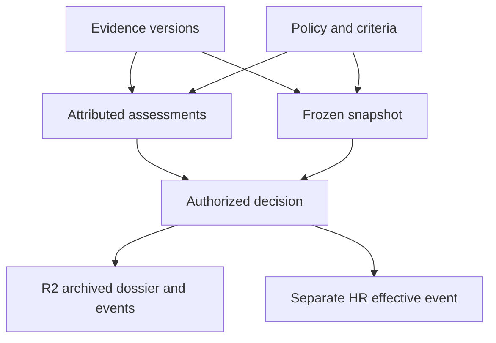

# LIONG People Graph

# Calibration Analytics and Decision Provenance

| Document control | Value |
| --- | --- |
| Document ID | LIONG-013 |
| Version | 0.3 |
| Date | 2026-10-03 |
| Status | Version 0.1 approved; maintenance revision |
| Approved dependencies | LIONG-003/004 requirements; LIONG-006/007 model rules; LIONG-009 integration; LIONG-012 v0.2 architecture; approved ontology update set |
| Implementation status | Proposed calculations and output contracts; no analytical products deployed |

## Current package status — 2026-10-03

LIONG-001 through LIONG-017 are approved at the baselines recorded in LIONG-REG-001. This maintenance revision consolidates status references; it does not change approved policy. Earlier draft wording and future-tense sequence descriptions describe design history, not pending approval. Implementation gates and unexecuted tests remain open. See [README](README.md) for current document versions and [reference register](LIONG-REF-001_Consolidated_Reference_Register.md) for source links.

## 1. Purpose and boundary

Calibration compares evidence and assessments under explicit criteria. It helps reviewers identify gaps, inconsistent treatment, and decisions that need explanation.

This document defines comparison groups, calculations, review signals, and decision dossiers. It implements the approved rating and promotion questions in LIONG-004. It does not assign a rating, rank employees for promotion, or prescribe a forced rating distribution.

Separate four outputs: source observations, calculated measures, review signals, and authorized judgments. A signal requests review. It does not establish bias, misconduct, or promotion readiness.

All durable analytical data, definitions, snapshots, and decision artifacts reside in Cloudflare R2. PostgreSQL serves governed records and workflow state. DuckDB performs bounded calculations; optional Databricks processing requires the checks in LIONG-012. Neo4j retrieves qualified evidence relationships. No additional runtime is selected.

## 2. Terms and output classes

| Term | Definition |
| --- | --- |
| Analysis population | Authorized records eligible for the declared analysis scope |
| Cohort | A versioned comparison group with reproducible inclusion and exclusion rules |
| Assessed denominator | Distinct eligible review cases with a valid selected rating category and assessed status |
| Evidence coverage | Presence of required assessment and evidence structures; not proof of performance quality |
| Review signal | A rule-based finding that identifies a case or group for human review |
| Judgment | An identified assessor or panel's interpretation under applicable policy |
| Decision dossier | Versioned criteria, evidence, assessments, context, gaps, and decision history for one case |

| Output class | Example | Required attribution |
| --- | --- | --- |
| Observation | A proposed R4 rating exists for the selected review | Source record, version, assessor, time |
| Calculation | Four of twenty assessed reviews have R4 | Definition version, inputs, denominator, release |
| Signal | A selected manager's R4 share differs from the comparable remainder | Rule version, threshold, group sizes, limitations |
| Judgment | The panel retains the rating with a recorded rationale | Authority, decision version, policy, snapshot |

Do not convert any of these outputs into a permanent property such as PERSON_IS_HIGH_PERFORMER.

## 3. Analysis context contract

Every analytical request requires the following context.

| Field | Required content |
| --- | --- |
| analysis_id | Stable identifier for the calculation run |
| requester_scope_ref | Authorized analytical scope and policy version |
| release_id | Compatible canonical and projection release |
| workflow_checkpoint | Included interactive event checkpoint, or explicitly none |
| cycle_id or window_id | Review cycle or promotion window |
| rating_stage | Proposed, final, or revision comparison |
| cutoff_mode and cutoff | Available-at historical mode or explicitly labelled retrospective mode |
| cohort_definition_version | Inclusion, exclusion, grouping, and compatibility rules |
| measure_version | Calculation specification and rounding rules |
| policy/criterion versions | Applicable definitions and compatibility decisions |
| source_status | Checkpoints, unavailable inputs, exceptions, and freshness |

An answer must state its denominator and scope. If a requester sees only a subset, label the result as that authorized subset. Do not call it an enterprise distribution. A separately authorized aggregate product can have a broader scope only under an explicit disclosure rule.

A current query and a past decision explanation use different selection rules. Never use later evidence to fill an earlier dossier without declaring retrospective use.

## 4. Rating cohort construction

Propose the following initial cohort rules under DEC-057.

1. Select one review cycle, one rating stage, and one compatible publication checkpoint.
2. Use role family, career track, and job level as initial grouping dimensions.
3. Separate role templates or criterion versions whose expectations are not comparable.
4. Retain assignment duration and work context as explicit comparison context.
5. Use site and manager as analytical dimensions, not automatic definitions of comparable work.
6. Create membership records with inclusion and exclusion reasons.

A role family alone is insufficient. A technical operator and a maintenance specialist can share a business unit while having different evaluation expectations. A trainee and an experienced specialist must not become comparable merely to increase sample size.

Do not widen the cohort automatically when it is small. A reviewed compatibility definition can authorize a broader cohort. Record that definition and show its changed scope.

At the overall-rating grain, count one review case once. A transferred employee can have several assignment-period assessments but one overall cycle review. Period-specific contribution analysis uses a separate grain and must not inflate the overall denominator.

Do not add a minimum time-in-role requirement for promotion eligibility. Assignment duration is analytical context; the approved promotion policy has no universal tenure threshold.

### 4.1 Manager comparison attribution

Use the recorded submitting assessor or responsible manager for proposed-rating comparisons. Do not attribute a past proposal to the employee's current manager.

For final ratings, report the originating manager context and calibration authority separately. Label the product as final-rating composition by originating manager, rather than imply that the manager alone assigned the final outcome.

An employee's transfer history remains visible to authorized reviewers. Do not split one overall rating fractionally across managers unless a separate approved measure defines that behavior.

## 5. Rating measures

| Measure | Definition | Exclusions and interpretation |
| --- | --- | --- |
| Eligible review count | Distinct review cases in the authorized cohort | Includes explicit incomplete/not-applicable states |
| Assessed count | Eligible cases with assessed status and a valid selected category | Invalid or missing categories remain exceptions |
| Category count | Assessed cases with the selected category | R1, R2, R3, and R4 reported separately |
| Category share | Category count / assessed count | Undefined when assessed count is zero |
| Incomplete count | Eligible cases with incomplete assessment status | Not substituted with R1 or R2 |
| Not-applicable count | Eligible cases with explicit not-applicable status | Not part of category-share denominator |
| Data-exception count | Cases with unresolved status, category, or identity issues | Not silently counted as incomplete or assessed |
| Rating-change count | Matched cases whose proposed and final categories differ | Unmatched cases reported separately |
| Transition table | Counts for each proposed-category/final-category pair | Shows categorical movement, not numeric distance |

Counts must reconcile to the declared mutually exclusive status groups. Preserve an explicit bucket for cases that cannot be classified safely. Proposed and final distributions have independent status and publication completeness.

Percentages use unrounded counts. Propose display rounding to one decimal place. Displayed shares can sum to 99.9 or 100.1 due to rounding; do not alter category counts to force 100.0.

Do not calculate an average rating, subtract R1–R4 codes, or treat R4 as twice R2. Ordered categories do not establish equal spacing or a ratio scale.

### 5.1 Worked distribution

This is a calculation fixture, not an observed LIONG population.

| Review state/category | Cases |
| --- | ---: |
| R1, assessed | 2 |
| R2, assessed | 4 |
| R3, assessed | 12 |
| R4, assessed | 6 |
| Incomplete | 4 |
| Not applicable | 1 |
| Unresolved data exception | 1 |
| Total eligible cases | 30 |

The assessed denominator is 24. R4 share is 6 / 24 = 25.0%. R4 is not 20.0% of assessed reviews. The latter value uses all 30 eligible cases and answers a different question. Retain all six groups in the completeness report.

## 6. Descriptive manager review signals

Propose a simple first-stage method under DEC-058. It is a simulation review rule, not an industry benchmark or statistical finding.

Within one approved comparable cohort, calculate category shares for a manager's assessed proposals and for the assessed remainder of that cohort, excluding that manager's cases. Do not compare overlapping groups without declaring the overlap.

Propose a minimum of 10 assessed cases in each comparison group before displaying a manager-difference signal. Propose an absolute R4-share difference of at least 20 percentage points as the initial fixture threshold. Both values are design proposals. LIONG-016 will test their usefulness and error rates before operational use.

Report counts, shares, group composition, threshold version, exclusions, assignment-duration context, and source completeness. If role-specific expectations are incompatible, produce no comparison even when counts exceed the minimum.

For example, 8 of 20 proposals are R4 for one manager and 4 of 20 are R4 for the comparable remainder. The descriptive difference is 40% minus 20% = 20 percentage points. The proposed signal requests review. It does not establish why the groups differ.

No significance test, bias score, causal claim, or automatic rating change is included in the first method. Do not call the signal statistically significant. Other category shares can be displayed descriptively without additional automatic thresholds.

The minimum count is an analytical stability rule. It is not a privacy guarantee. LIONG-015 owns disclosure thresholds, complementary suppression, and protection against repeated-query inference. Apply access and disclosure rules before returning results. If those rules are unresolved, restrict the demonstration to approved synthetic scopes rather than claim production privacy.

## 7. Promotion comparison and criterion coverage

Promotion comparisons use target-role or progression-route context, target track and level, policy/criterion versions, review window, and work scope. Current job level alone does not define a valid comparison group.

Show four separate dimensions for each nomination:

| Dimension | Output |
| --- | --- |
| Administrative eligibility | Rule-level satisfied, unsatisfied, or unknown status |
| Target-level capability assessment | Attributed criterion judgments and their evidence |
| Position or progression authorization | Authorized, pending, absent, or disputed context under policy |
| Panel outcome | Recorded decision, authority, rationale, and snapshot |

Propose these completeness measures under DEC-059:

| Measure | Definition | Interpretation |
| --- | --- | --- |
| Assessment coverage | Applicable criteria with a recorded criterion assessment / applicable criteria | Assessment presence, not a capability score |
| Evidence-link coverage | Applicable criteria with an assessment and at least one valid permitted evidence link / applicable criteria | Bounded accessible support, not proof that claims are correct |
| Unknown-applicability count | Criteria whose applicability cannot be resolved | Coverage is provisional until this count is resolved |
| Disputed-criterion count | Criteria with unresolved conflicting assessments or claims | Keep disagreement visible |
| Decision-snapshot resolution | Referenced evidence/policy versions successfully resolved for the permitted scope | Technical traceability check |

When the applicable denominator is zero, return not applicable or unresolved applicability according to the recorded rules. Do not report 100% coverage. Show the number of unknown criteria separately.

Four assessed criteria out of five applicable criteria yield 80% assessment coverage. This does not mean the employee is 80% ready. A single mandatory criterion can remain decisive under policy even when other evidence is extensive.

Do not combine these dimensions into a promotion score. Do not rank nominations automatically by evidence count or dossier length. Missing position authorization does not prove a capability gap.

## 8. Evidence counting and gap interpretation

Count evidence versions for traceability. Count common origins separately for independence checks. Repeated quotations, duplicate exports, and derived summaries do not become independent support.

| Condition | Analytical treatment |
| --- | --- |
| Exact transport duplicate | One canonical version; retain ingestion lineage |
| Two documents quote one work record | Retain two artifacts and one shared origin |
| One record supports two criteria | Retain both links; do not claim two independent observations |
| Contradictory assessments | Preserve authors, scopes, dates, and disagreement |
| Evidence arrives after cutoff | Exclude from original historical view; label retrospective use |
| Source retrieval fails | Report unavailable source; do not assert absent evidence |
| Identity unresolved | Exclude unsafe linkage and report permitted limitation |
| Record inaccessible to requester | Apply disclosure policy; do not expose restricted existence by default |

A coverage calculation operates on a declared evidence scope. It cannot claim enterprise completeness when accessible sources are partial. Dossier builders with broader authorized scope and ordinary users can receive different bounded views.

## 9. Decision dossier contract

Each dossier version represents one case at one declared checkpoint. It includes:

| Section | Required content |
| --- | --- |
| Identity and context | Person/case IDs, dated assignments, target role/level, source identity status |
| Policy | Exact policy and criterion versions, applicable dates, selection rules |
| Criteria | Expectations, applicability, assessor judgments, status, rationale |
| Evidence | Version IDs, source/author, dates, lineage, permitted passage references |
| Gaps and disputes | Missing, late, unavailable, conflicting, and unresolved context |
| Comparison | Cohort definition, membership rules, counts, limitations |
| Authorization | Position authorization, session scope, conflict declarations, chair authority |
| Decision | Outcome, rationale, responsible authority, time, evidence snapshot |
| Revisions | Prior version, reopening reason, new evidence, later outcome |
| Reproducibility | Release, workflow checkpoint, calculation/tool versions, object digests |

A generated summary is labelled as generated. It cannot substitute for the panel's recorded rationale. Link each material summary claim to authorized evidence or an attributed assessment. Keep factual observations and interpretations distinguishable.

A final dossier can preserve snapshot membership without disclosing all of it to every requester. Recheck access on retrieval. Version history does not override access withdrawal or retention rules.

## 10. Provenance and publication

The HR arrow is a linked workflow handoff, not an automatic assignment update. SYS-HR still owns the effective event.

Before final publication, verify evidence and policy version resolution, required authority, conflict checks, cutoff rules, and the decision snapshot. Use the R2 acknowledgment and transactional-outbox protocol in LIONG-012.

Publication failures produce pending status. They do not erase the locally committed event or justify reporting durable completion. Reopening appends a new case revision and decision. The original snapshot remains reconstructible under retention and access policy.

Analytical products carry source checkpoints and calculation versions. A later mapping or cohort definition creates a new product version. It must not change an earlier decision explanation silently.

## 11. Ontology use in analytical outputs

Exact terms remain subject to the approved mapping and artifact gates. Links below identify candidate vocabulary sources, not completed mappings.

| Resource | Use in this document | Boundary |
| --- | --- | --- |
| [PSDO](https://www.ebi.ac.uk/ols4/ontologies/psdo) | Describe summary content, comparators, time, and scale presentation | Does not authorize ratings or numeric category distances |
| [ORG](https://www.w3.org/TR/vocab-org/) | Dated organizational and position context | Employment and assignment semantics remain explicit |
| [CTDL-ASN](https://credreg.net/ctdlasn/terms) | Competency criteria and rubric definitions | Does not establish employee proficiency |
| [Web Annotation](https://www.w3.org/TR/annotation-model/) | Exact passage targets for evidence and comments | Resolve immutable parent version and authorization |
| [PROV-O](https://www.w3.org/TR/prov-o/) | Authorship, derivation, revision, and responsible activities | Provenance does not establish truth |
| [SEPIO](https://www.ebi.ac.uk/ols4/ontologies/sepio) | Pilot claim-to-evidence structure in one dossier | Scientific-to-personnel adaptation remains open |
| [OWL-Time](https://www.w3.org/TR/owl-time/) | Candidate interval interchange | Preserve valid/available-time and cutoff fields |
| [SKOS](https://www.w3.org/TR/skos-reference/) and [ESCO](https://esco.ec.europa.eu/en/use-esco) | Reviewed criterion/skill labels and reference alignment | No automatic skill assertion from role requirements |

CTDL learning pathways and ODRL policy expression remain later or deferred under DEC-056. They are not required for the initial analytical products.

## 12. Question coverage and acceptance cases

| Question IDs | Required analytical or dossier behavior |
| --- | --- |
| CQ-P01–P03 | Resolve criteria, evidence coverage, and bounded gaps |
| CQ-P04–P05 | Separate eligibility and position authorization |
| CQ-P06–P07 | Expose authorized contradictions and decision provenance |
| CQ-P08–P10 | Separate HR effectiveness, comparability, and reopening history |
| CQ-R01–R02 | Preserve proposed/final values and change rationale |
| CQ-R03–R04 | Reconcile distributions and scoped manager comparisons |
| CQ-R05–R07 | Identify unsupported assessments, transfer context, and shared origins |
| CQ-R08 | Show labelled cycle history with policy/assignment changes |
| CQ-C01–C07 | Enforce available-time, authorization, citations, limitations, and source context |

| Fixture | Required result |
| --- | --- |
| Zero assessed cases | Counts retained; category share undefined |
| Worked 30-case distribution | Assessed count 24; R4 share 25.0% |
| Manager and remainder each have 20 cases, shares 40% and 20% | Proposed descriptive signal; no bias or significance claim |
| Manager group has 9 assessed cases | No manager-difference signal under proposed minimum |
| Incompatible role criteria despite large counts | No comparable-group signal |
| Transfer with two assignment assessments | One overall review in denominator; both contribution periods retained |
| Full link coverage with a disputed mandatory criterion | Dispute remains; no readiness conclusion |
| Duplicated work evidence | Shared origin retained; no independent-support inflation |
| Late evidence and reopened case | Original snapshot unchanged; later revision labelled |
| Missing HR effective event | Approval remains distinct from effective promotion |
| Restricted evidence or source outage | Authorized bounded answer without fabricated absence |

LIONG-016 will add numerical retrieval, correctness, performance, and recovery thresholds. This document provides deterministic fixtures, not a validated operational fairness method.

## 13. Approved decisions and remaining items

| ID | Proposal | Status |
| --- | --- | --- |
| DEC-057 | Explicit rating/promotion cohorts and period-correct manager attribution | Approved |
| DEC-058 | Descriptive R4-share review signal; minimum 10 assessed cases per group; threshold 20 percentage points | Approved |
| DEC-059 | Separate applicability, assessment coverage, evidence-link coverage, and disputes; no readiness score | Approved |
| DEC-060 | Versioned dossier contract with exact decision/evidence provenance and authorized views | Approved |
| DEC-061 | Analytical release/context contract, reproducible calculations, and defined acceptance fixtures | Approved |

The user approved version 0.1 and DEC-057 through DEC-061 on 2026-10-03. OI-04 is resolved for the initial simulation method. Privacy disclosure rules and operational evaluation remain open. LIONG-015 must still define disclosure and retention rules. LIONG-016 must evaluate signal usefulness and operational thresholds. Exact ontology mappings and selected release licenses remain open.

## 14. Impact and next document

The approved ontology updates remain selective reuse assessments. This draft introduces analytical rules without changing the approved rating categories, promotion windows, authority, workforce counts, or source responsibilities.

The charter and register record ontology-update approval and the new draft. LIONG-012 records approval and refers to this analytical design. DEC-057 through DEC-061 are now approved. LIONG-014 interface choices remain proposals.

LIONG-014 — Agent, MCP, and User Experience Design is drafted for review. It proposes conversational tools and calibration interfaces using these approved measures.

## 15. Change history

| Version | Change | Status |
| --- | --- | --- |
| 0.1 | Defines proposed cohorts, rating measures, descriptive signals, criterion coverage, dossiers, provenance, and fixtures | Pending review |
| 0.2 | Records v0.1 approval and references LIONG-014 draft; analytical rules unchanged | Maintenance revision |

Maintenance record: 0.3 consolidates the approved package status and index links on 2026-10-03.
