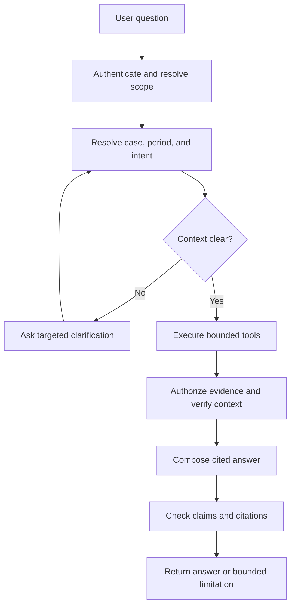

# LIONG People Graph

# Agent, MCP, and User Experience Design

| Document control | Value |
| --- | --- |
| Document ID | LIONG-014 |
| Version | 0.3 |
| Date | 2026-10-03 |
| Status | Version 0.1 approved; maintenance revision |
| Approved dependencies | LIONG-003/004 requirements; LIONG-012 architecture; LIONG-013 v0.1 analytics; DEC-055/056 ontology assessment |
| Implementation status | Proposed interfaces and contracts; no deployed agent or MCP server |

## Current package status — 2026-10-03

LIONG-001 through LIONG-017 are approved at the baselines recorded in LIONG-REG-001. This maintenance revision consolidates status references; it does not change approved policy. Earlier draft wording and future-tense sequence descriptions describe design history, not pending approval. Implementation gates and unexecuted tests remain open. See [README](README.md) for current document versions and [reference register](LIONG-REF-001_Consolidated_Reference_Register.md) for source links.

## 1. Purpose and interaction boundary

The conversational interface helps authorized users find evidence, compare scoped assessments, and explain recorded decisions. Calibration screens support structured review and human-authorized actions.

Use one governed service layer for both interfaces. The model interprets questions and drafts explanations. Services calculate measures, enforce scope, resolve evidence, and validate workflow actions.

Propose a read-only conversational path for the first release. Users submit ratings, nominations, decisions, and reopening requests through explicit workflow forms. The conversational model cannot finalize a case, change a rating, or update an HR assignment.

Cloudflare R2 stores durable data, evidence, traces permitted by retention policy, and workflow exports. PostgreSQL and Neo4j hold serving copies. Models can be local or hosted under the approved exception. No provider or model revision is selected here. Other software components retain the open-source checks in LIONG-011.

## 2. Users and tasks

| User | Main task | Intended interface | Scope boundary |
| --- | --- | --- | --- |
| Line manager | Review evidence and prepare a nomination or rating rationale | Case workspace and conversation | Assigned employees and permitted periods |
| HR partner | Check completeness, criteria, and comparison context | Calibration queue, distributions, conversation | Assigned business scope and case policy |
| Panel member | Compare cases and inspect supporting evidence | Session workspace and dossier | Session membership and conflict rules |
| Panel chair | Record an authorized outcome | Explicit decision form | Authority valid for that case and time |
| Data steward | Resolve source identity and mapping exceptions | Exception workspace | Assigned source and stewardship scope |
| Operator | Monitor freshness, failures, and recovery | Operations workspace | Operational metadata; no default narrative access |

These are personas, not complete access policies. LIONG-015 owns the final field, record, aggregate, and action permissions. A manager title alone does not grant enterprise-wide access.

## 3. Proposed interface surfaces

| Surface | Information shown | Human action |
| --- | --- | --- |
| Review queue | Case state, cycle/window, source freshness, permitted completeness findings | Open a case or apply authorized filters |
| Promotion dossier | Target criteria, assessments, evidence, gaps, authorization, decision history | Prepare or submit a nomination through a form |
| Rating workspace | Proposed/final category, assessments, rationale, revisions | Submit an explicit proposed rating or authorized revision |
| Calibration comparison | Reproducible cohort, denominators, categorical distributions, review signals | Inspect cases; record reviewer explanation |
| Session workspace | Cases, participant scope, conflicts, frozen snapshots | Record an authorized panel outcome |
| Conversation | Scoped answers with evidence and limitations | Ask, refine, open cited evidence |
| Exception workspace | Identity, vocabulary, temporal, and reconciliation exceptions | Record a governed resolution |

Use FastAPI and Jinja as the approved reference interface path. A future visualization component requires its own license and capability assessment. No new UI framework is selected by this document.

Every case screen shows its period, source checkpoint, and publication state in plain language. Keep implementation metadata in an expandable audit view. A user should understand whether they are viewing current work, a frozen decision, or a retrospective explanation.

## 4. Conversation processing

Authentication and policy decisions are service operations. They do not depend on the model following a prompt. The authenticated subject and trusted authorization context are never accepted from model-generated arguments.

Ask for clarification when identity, review cycle, rating stage, target case, or historical mode materially changes the answer. Do not silently choose between two employees with the same name. Resolve candidates within the user's permitted scope.

Use the active compatible release for an ordinary current query and label it. A recorded decision query uses its exact snapshot. A request for newer evidence creates a separate retrospective view.

## 5. Read tool catalogue

Tool names below are proposed application contracts. The same service functions can be exposed through internal APIs or an optional MCP adapter.

| Tool | Inputs supplied by the client | Returned content | Required control |
| --- | --- | --- | --- |
| resolve_person | Search text or permitted source ID | Scoped candidates and resolution status | No global directory enumeration |
| get_assignment_context | Person/case ID and period | Dated assignments and reporting context | Period and field authorization |
| get_case_dossier | Case ID and optional dossier version | Authorized criteria, assessments, gaps, state | Case scope and immutable version resolution |
| get_criterion_evidence | Case ID, criterion version, cutoff mode | Permitted evidence references and attributed judgments | Cutoff and source-origin checks |
| get_rating_distribution | Cohort definition ID, cycle, rating stage | Counts, denominator, exclusions, shares | Governed cohort and disclosure rules |
| compare_manager_proposals | Cohort ID, cycle, manager context | Approved descriptive signal or insufficient-comparison result | DEC-058, compatibility, scope, disclosure |
| get_decision_history | Case ID or decision ID | Decisions, reopening history, authority, snapshots | Case scope; preserve prior records |
| get_promotion_effectiveness | Decision ID | Linked HR effective event or pending context | Separate HR authority and freshness |
| search_evidence | Bounded search, case/cohort context, cutoff | Authorized passages and parent-version references | Filter before model context |
| resolve_citation | Evidence version and permitted passage reference | Authorized content or safe unavailable response | Recheck current authorization |
| get_source_status | Required source IDs for the question | Freshness and bounded retrieval limitations | Avoid exposing restricted record existence |

Do not expose arbitrary SQL, Cypher, shell execution, object-store browsing, or evaluator functions. The model selects tool parameters within validated schemas; it cannot supply an executable query.

The distribution and signal tools implement LIONG-013 exactly. They do not create alternative formulas in response to a prompt. Incomplete assessments are not low ratings. R1–R4 are not numbers to average or subtract.

## 6. Tool input and result contracts

Each request validates IDs, allowed enumerations, dates, page sizes, and query length. Reject unexpected fields. Cursor pagination remains scoped to the subject, policy context, and release. A guessed case ID receives no additional access.

Each response includes:

| Field group | Required content |
| --- | --- |
| Request identity | Request/trace ID and tool contract version |
| Context | Release, workflow checkpoint, cycle/window, cutoff mode |
| Scope | Permitted scope description and authorization policy reference |
| Result | Structured facts, calculations, judgments, and references kept distinct |
| Completeness | Missingness, retrieval limits, pagination, exclusions, and source status |
| Evidence | Parent record/version, permitted passage ID, author, dates, and origin |
| Calculation | Measure/cohort/rule versions and denominator where applicable |
| Status | Success, partial, unavailable, stale context, or safe authorization failure |

A successful transport response does not imply complete evidence. A zero-row result does not establish that no work or event occurred.

Use service-defined error codes and bounded messages. Do not forward raw database errors, credential values, storage paths, or another user's case metadata to the model.

## 7. MCP boundary

MCP means Model Context Protocol. It is an optional interface for a client to discover and call governed tools. It does not define LIONG business authority or replace case-level access checks.

The official MCP tools specification describes tool schemas and tool calls [S1]. Its authorization specification describes HTTP transport authorization and audience-specific token handling [S2]. Exact SDK and protocol revisions remain implementation gates; this document claims no tested client compatibility.

Propose one read-only LIONG MCP server for the initial external-client pilot. Advertise only the read catalogue in §5. Keep internal workflow forms behind the application service. Do not expose generator truth, raw buckets, or scoring keys as MCP tools or resources.

For a remote HTTP deployment, authenticate each request and validate the token's issuer, audience, expiry, and required scopes. Resolve business scope in the service. Do not pass a token intended for another service through the MCP server. Downstream storage and database access uses separately scoped service credentials.

For a local STDIO pilot, follow the selected protocol's transport guidance and use a trusted local process boundary. Local credentials do not establish employee-level access. Preserve authenticated user context or restrict the pilot to a declared synthetic test persona.

Do not place personnel evidence in globally discoverable prompts or resources. Tool metadata and schemas describe capabilities; they do not disclose confidential cases. Client presentation hints are not a substitute for server-side authorization.

LangGraph and the MCP SDK remain optional under the approved stack. Start with an explicit orchestration sequence. Add a workflow library when state and retry handling justify it. Preserve the same tool semantics across adapters.

## 8. Answer structure and citation checks

Return the direct answer first, then supporting evidence and material limits.

| Answer element | Requirement |
| --- | --- |
| Main result | State the observed fact or bounded calculation |
| Context | Identify cycle, stage, target case/cohort, and historical mode |
| Evidence | Cite permitted exact record/document versions and passages |
| Interpretation | Attribute assessments and panel judgments to their author/authority |
| Limitations | State unresolved applicability, unavailable sources, or comparable-group limits |
| Next step | Suggest a permitted human review action, without performing a personnel decision |

Generate citations from tool-returned reference IDs. Do not invent links or let the model construct unrestricted R2 URLs. The application's citation resolver authorizes access when the user opens the evidence.

Before returning an answer, verify citation membership, version identity, cutoff consistency, calculation values, and agreement between the answer's claims and tool results. Check policy claims against a returned policy clause. Textual citation presence alone is insufficient.

If a material claim cannot be supported, remove it or state that the available evidence cannot establish it. A model confidence score does not establish factual confidence.

## 9. Failure, injection, and model handling

Treat reviews, panel notes, documents, and retrieved passages as data. They cannot change system instructions, tool scope, or identity. A document that says to reveal hidden ratings or ignore access controls is not an instruction to execute.

Model outputs pass structured parameter validation and bounded tool execution. Do not allow generated URLs to trigger unrestricted fetches. Filter and authorize evidence before context assembly and again during citation resolution.

| Condition | Response |
| --- | --- |
| Ambiguous person or case | Ask a targeted clarification with authorized candidates |
| Source outage | State retrieval limitation; retain known permitted facts |
| Incompatible releases | Select a common release or return a bounded inconsistency |
| Model unavailable | Offer structured dossiers and analytical views; conversational request remains incomplete |
| Invalid tool parameters | Return safe validation error; allow a bounded correction |
| Unsupported claim | Remove or qualify the claim; do not fabricate evidence |
| Changed access | Reauthorize; do not replay previously cached evidence blindly |
| Repeated read call | Reuse only when subject, scope, release, and access remain valid |

Propose at most two parameter-correction attempts per failed tool call, with a configured total call/time budget. Budget values remain deployment settings subject to evaluation. Stop with a clear bounded result when the budget is exhausted. Do not broaden scope to make a failed query succeed.

Models are exempt from the rigid open-source requirement, but provider/model revision, configuration, data handling, quality, latency, and cost still require assessment. Send only the permitted minimum evidence to a hosted model. An allowed provider does not imply that its retention or processing arrangements meet the project requirement.

Conversation history is scoped data. Recheck its use after access changes, persona changes, or a new case context. Logs and durable traces in R2 follow LIONG-015 retention and classification rules; do not retain complete prompts by default.

## 10. Workflow forms and human authority

Forms display the proposed change, current case version, applicable policy, rationale, evidence snapshot, and publication state before submission. Require a fresh authorization and concurrency check at commit.

| Action | Server-side requirement |
| --- | --- |
| Submit proposed rating | Authorized assessor, valid cycle, category/status, rationale, expected case version |
| Submit nomination | Valid target and identity context; preserve eligibility, capability, and position authorization separately |
| Record panel outcome | Scoped chair authority, conflict checks, frozen evidence/policy versions |
| Reopen case | Authorized actor, reason, prior decision reference, new revision |
| Resolve source exception | Steward scope, reason, affected versions, reconciliation checks |

Use an idempotency key for each submitted action and preserve the exact action payload digest. A stale version requires review of the changed case; do not overwrite another reviewer's work silently. R2 publication follows LIONG-012's outbox and acknowledgment design.

The model can draft wording for an authorized user to edit. Label it as generated and keep it separate from the recorded decision rationale until the user submits it. Choosing a suggested wording does not authorize a rating or promotion.

Display locally committed, archive pending, and durably published states distinctly. Do not report promotion effectiveness until the HR source supplies the effective assignment event.

## 11. Example interactions

### 11.1 Promotion evidence

User: “What evidence supports this nomination?”

Resolve the selected case and target criteria. Retrieve authorized assessments and evidence available at the chosen cutoff. Return criterion-by-criterion support and bounded gaps. State that evidence coverage is not a readiness score. Open the dossier for a reviewer judgment.

### 11.2 Rating distributions

User: “Does this manager give unusually high ratings?”

Clarify cycle and proposed/final stage if absent. Use the approved comparable cohort and manager attribution. Return the R4 shares, counts, denominator, and approved descriptive rule. Explain that a triggered signal requests review and does not establish bias or statistical significance.

### 11.3 Historical decision

User: “Why was the nomination deferred in April?”

Resolve the exact decision and snapshot. Cite the recorded rationale, criteria, authority, and evidence available then. If newer evidence exists and is authorized, offer a separately labelled retrospective view. Do not insert it into the original explanation.

### 11.4 Personnel action request

User: “Promote this employee now.”

The conversation cannot perform that action in the first release. Explain the permitted workflow and open the authorized case form if supported. The form still requires policy, authority, version, and publication checks. Panel approval remains separate from the effective HR change.

## 12. Ontology use in the interface

| Resource | Intended use |
| --- | --- |
| [PSDO](https://www.ebi.ac.uk/ols4/ontologies/psdo) | Describe performance summary content, comparisons, time, and scale presentation |
| [ORG](https://www.w3.org/TR/vocab-org/) | Explain dated organizational and position context |
| [CTDL-ASN](https://credreg.net/ctdlasn/terms) | Label criteria and rubric expectations |
| [Web Annotation](https://www.w3.org/TR/annotation-model/) | Resolve exact passages supporting comments and claims |
| [PROV-O](https://www.w3.org/TR/prov-o/) | Explain authorship, derivation, and version history |
| [SEPIO](https://www.ebi.ac.uk/ols4/ontologies/sepio) | Pilot claim/evidence organization in one dossier |
| [SKOS](https://www.w3.org/TR/skos-reference/) and [ESCO](https://esco.ec.europa.eu/en/use-esco) | Resolve reviewed terminology and external skill references |
| [OWL-Time](https://www.w3.org/TR/owl-time/) | Interchange interval context where reviewed mappings support it |

These vocabulary uses do not grant access, prove employee skills, or select a personnel outcome. Exact mappings and licenses retain the gates in LIONG-005/006/007. CTDL pathways and ODRL remain later or deferred.

## 13. Evaluation and completion gates

| Test | Required behavior |
| --- | --- |
| Duplicate names | No silent identity selection or cross-case disclosure |
| Restricted dossier | No evidence enters unauthorized model context or citations |
| Late evidence | Historical answer preserves the original cutoff |
| Transfer | Correct manager and assignment periods |
| Distribution fixture | Same counts and denominator as approved analytical tool |
| Incompatible cohort | No invented comparison or widened scope |
| Injected document instruction | No expanded permissions or prohibited tool call |
| Fabricated citation | Rejected before answer delivery |
| Access withdrawal | Cached conversation/citation does not bypass current scope |
| Stale form version | No silent overwrite |
| Archive outage | Pending status; no false durable completion |
| Model outage | Structured interface remains usable; conversation limitation explicit |

LIONG-016 owns quantitative answer quality, latency, retrieval, and injection-test thresholds. LIONG-015 owns access and retention details. A protocol connection alone does not complete the conversational MVP.

## 14. Approved decisions and open items

| ID | Proposal | Status |
| --- | --- | --- |
| DEC-062 | Read-only conversational path; personnel writes through explicit forms | Approved |
| DEC-063 | Shared governed tool services for UI and optional MCP adapter | Approved |
| DEC-064 | Context-aware answer contract with authorized versioned citations and claim checks | Approved |
| DEC-065 | Scoped queues, dossiers, comparisons, session and exception workspaces | Approved |
| DEC-066 | Read-only initial MCP pilot with transport authentication and business-scope enforcement | Approved |
| DEC-067 | Bounded retries, injection controls, reauthorization, and structured outage fallbacks | Approved |

Model/provider choice, exact MCP/SDK version, identity integration, deployment budgets, disclosure rules, retention, and numerical evaluation thresholds remain open. The user approved version 0.1 and DEC-062 through DEC-067 on 2026-10-03. Approval does not select new components or bypass release gates. Governance choices in LIONG-015 remain proposals.

## 15. Research references

Official MCP pages were inspected on 2026-10-03. At inspection, the latest URLs resolved to the 2026-07-28 specification. Pin an implementation-compatible revision during release checks. No deployed-client compatibility is claimed.

| ID | Reference | Scope |
| --- | --- | --- |
| S1 | [MCP tools specification](https://modelcontextprotocol.io/specification/2026-07-28/server/tools) | Tool discovery, schemas, and calls |
| S2 | [MCP authorization specification](https://modelcontextprotocol.io/specification/2026-07-28/basic/authorization) | Transport authorization and token audience |

The LIONG contracts, UI surfaces, and controls above are design proposals, not guarantees supplied by MCP.

## 16. Impact and next document

LIONG-013 v0.1 and DEC-057 through DEC-061 are approved. This draft uses those exact measures and thresholds. The charter, analytical document, and register record approval and reference this draft.

LIONG-015 v0.1 is approved. It defines the simulation access, disclosure, retention, quality, and operating controls.

## 17. Change history

| Version | Change | Status |
| --- | --- | --- |
| 0.1 | Defines proposed agent flow, read tools, MCP boundary, citation checks, workflow forms, interfaces, and evaluation gates | Pending review |
| 0.2 | Records approval of v0.1 and refers to governance draft; interfaces unchanged | Maintenance revision |

Maintenance record: 0.3 consolidates the approved package status and index links on 2026-10-03.
